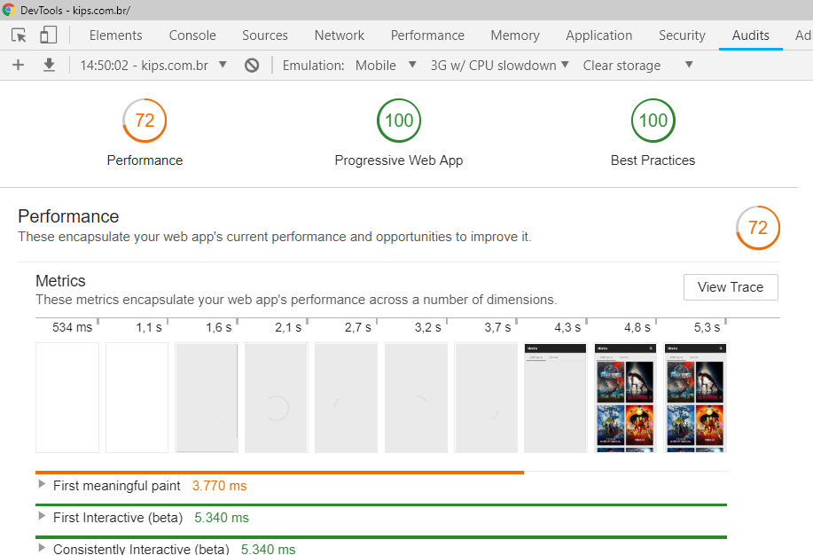
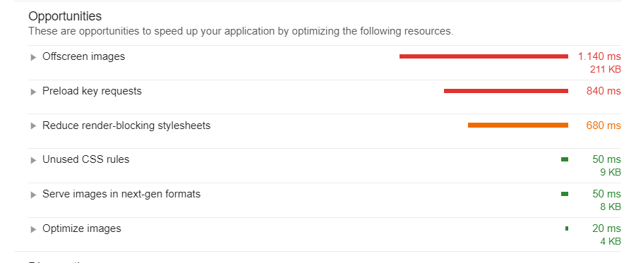

# the-movie-pwa

## Introdução

Este projeto foi criado com base no desafio de front-end da agenda edu. Favor ler todo o documento, que está ordenado por:

    * Instruções para run dev e build  
    * Instruções para simulação em servidor  
    * Análise dos dados de auditoria do projeto  
    * Feedback da realização  
    * Demo  

## Instruções de run e build

Este projeto foi desenvolvido com a ferramenta 'angular-cli'. Dito isso, para simulação do ambiente dev, devem se seguir estes passos:

    1. Clonar este repositório  
    2. Executar o comando `npm install`
    3. Executar o comando `ng serve -o`
    3b. Para simular o ambiente de produção, execute `ng serve -o --prod --aot`

## Instruções de simulação em servidor

Para simular o ambiente em um servidor, deve-se seguir estes passos:

    1. Executar o comando `npm install -g http-server`
    2. Na pasta do projeto, executar o comando `npm build --prod --aot`
    3. Na pasta dist que foi gerada, executar o comando `http-server`.
       No console poderá ser visto o host e porta necessários para acesso.
    

Run `ng serve` for a dev server. Navigate to `http://localhost:4200/`. The app will automatically reload if you change any of the source files.

## Análise de dados de auditoria

Utilizando a auditoria das ferramentas de desenvolvimento do Google Chrome, foi possível observar os seguintes dados em relação a performance, boas práticas e
funcionalidade como PWA.

PWA: 100 | Boas Práticas: 100 | Performance: **72**

As ocorrencias que vieram a atrapalhar o desempenho de performance da aplicação provieram especialmente de duas fontes. O carregamento Lazy Load das imagens, que atrasou
em cerca de 1 segundo o inicio da aplicação, e o carregamento dos arquivos gerados pelo build do angular. Devido a escolha de tecnologia, infelizmente não foi encontrado
workaround para os 800ms de atraso devido aos arquivos. Foi utilizada uma biblioteca de lazy load que otimizou o carregamento das imagens, porém deve ser estudado com 
mais calma o método adequado.

*A nota `72` em performance é considerada uma nota relativamente ok, e o tempo de renderização ficou em média entre 3 à 4 segundos, o que é um tempo aceitavel devido as circunstancias.*

Os requisitos de PWA e Boas Práticas foram satisfatórios

## Feedback e auto-análise

Para entendimento do avaliador, e para feedback do RH quanto ao método de admissão utilizado atualmente, me disponho a dar os seguintes feedbacks. Considerei um desafio interessante e divertido, embora devido a possuir outro vínculo empregatício, não pude dispor de tempo suficiente para acabamento maior do projeto. Seguem alguns pontos
de melhoria que vejo onde o código poderia ser melhorado:
    
    * A estrutura de testes automatizados foi montada, porém devido ao curto tempo que dispus para realização da tarefa,
      não pude fazê-los;
    * Foi implementado o infinite scroll on demand nas telas de pesquisa e de filmes populares, mas não na de favoritos.
      Esta decisão foi tomada levando em conta meu pouco tempo de desenvolvimento, e pela funcionalidade dos favoritos possuir
      uma demanda bem menor do que as outras em questão, tornando a otimização da paginação inicialmente irrelevante.
    * A forma de cache utilizada foi através da configuração de rotas de cache do Service Worker do angular. Optei essa solução
      devido ao pouco tempo que possuipara realização. A estrutura de cache poderia ser melhor arquitetada. O cache no
      firebase não foi implementado pelos mesmos motivos.
    * O tempo de renderização de 3.8s segundo a auditoria em anexo poderia ser melhorado se estudado uma forma de otimizar a
      forma que o build do angular-cli ordena o carregamento dos arquivos .js e .css
    * Decisões de UI/UX tomadas de forma a otimizar meu tempo de desenvolvimento, seguindo as boas práticas de uso dos componentes
      do Material Design, porém, ainda de forma simples.
    * Para efeitos de teste, apenas referenciei uma estrutura da RTDB do Firebase. Poderia ser criada uma estrutura de login
      anônimo, para armazenar individualmente os favoritos de cada usuário. Deixei alguns favoritos pré-carregados para efeito
      de demonstração

## Demo

A aplicação foi hospedada em um domínio de minha propriedade, e pode ser encontrada na url https://www.kips.com.br. 

OBS: A aplicação foi desenvolvida apenas para o viewport exclusivamente de dispositívos mobile, apenas para fins de demonstração. Não considerei a utilização em Desktops e Tablets.

Obrigado pela atenção!
